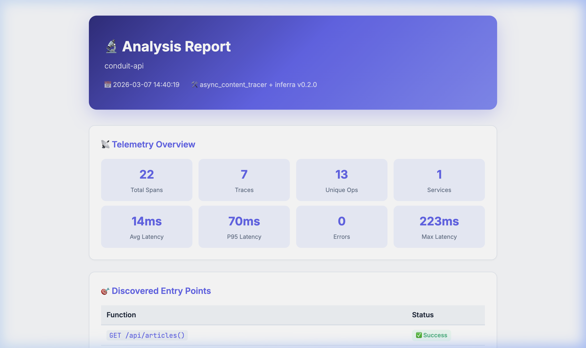
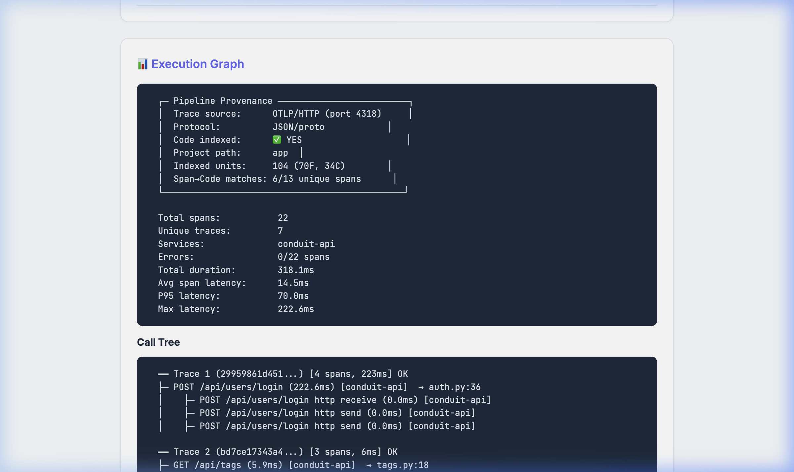

# Inferra — Autonomous Debugging via Trace-to-Code Correlation

[](https://github.com/deepgori/inferra/actions/workflows/tests.yml)

**Turn production traces into code-level diagnoses. Automatically.**

Inferra bridges the gap between observability tools (which show _what_ happened) and source code (which shows _why_ it happened). It ingests standard [OpenTelemetry](https://opentelemetry.io/) traces, maps each span to the exact function and line in your codebase via AST analysis, and produces a structured root cause analysis.

```
Your App (any language) → OTLP Traces → Inferra → Code-Aware Diagnosis
```

## The Problem

When a production API is slow, observability tools tell you:

> "`POST /api/users/login` took 189ms"

But they don't tell you _which function_ handles that endpoint, _what_ the code does, or _where_ the bottleneck is. You're left grep-ing through source code, matching route decorators to trace names by hand.

## What Inferra Does

Inferra automates that entire workflow:

1. **Receives** OTLP/HTTP traces from your instrumented application
2. **Indexes** your codebase — parses Python AST to extract every function, class, route handler, and their dependencies
3. **Resolves** router prefix chains (e.g., `app.include_router(api, prefix="/api")` + `router.include_router(articles, prefix="/articles")` + `@router.get("/{slug}")` → `GET /api/articles/{slug}`)
4. **Correlates** trace spans to source code — matches span names and `http.route` attributes to indexed route handlers
5. **Assembles** full function bodies into a structured context prompt
6. **Diagnoses** via LLM (Claude) — receives the code + trace context and produces line-level root cause analysis
7. **Generates** an interactive HTML report with call trees, timing analysis, and code references

### Without Inferra
> "The login endpoint is slow. Consider optimizing the authentication logic."

### With Inferra
> "`POST /api/users/login` at `auth.py:36` takes 189ms — 19x slower than baseline. The bottleneck is `users.authenticate()` which performs synchronous bcrypt password verification."

## Architecture

```
┌─────────────────────────────────────────────────────────────────────────┐
│                              Inferra                                    │
│                                                                         │
│  ┌──────────────┐   ┌───────────────┐   ┌──────────────────────────┐   │
│  │ OTLP Receiver │   │ Code Indexer  │   │   Route Prefix Resolver  │   │
│  │              │   │               │   │                          │   │
│  │ Protobuf     │   │ AST Parser    │   │ Parses include_router()  │   │
│  │ HTTP/JSON    │   │ TF-IDF Index  │   │ chains across files to   │   │
│  │ Span Buffer  │   │ Route Extract │   │ resolve full URL paths   │   │
│  └──────┬───────┘   └───────┬───────┘   └────────────┬─────────────┘   │
│         │                   │                         │                 │
│         ▼                   ▼                         ▼                 │
│  ┌──────────────────────────────────────────────────────────────────┐   │
│  │                    Span ↔ Code Correlator                        │   │
│  │                                                                  │   │
│  │  1. Route match (GET /articles/{slug} → articles.get)            │   │
│  │  2. http.route attribute match                                   │   │
│  │  3. Function name match                                          │   │
│  │  4. TF-IDF fuzzy search fallback                                 │   │
│  └──────────────────────────┬───────────────────────────────────────┘   │
│                             │                                           │
│         ┌───────────────────┼───────────────────┐                       │
│         ▼                   ▼                   ▼                       │
│  ┌─────────────┐   ┌───────────────┐   ┌───────────────┐               │
│  │ Heuristic   │   │ LLM Synthesis │   │ HTML Report   │               │
│  │ Analyzers   │   │ (Claude)      │   │ Generator     │               │
│  │              │   │               │   │               │               │
│  │ Latency     │   │ Receives full │   │ Call trees    │               │
│  │ Error class │   │ code context  │   │ Timing stats  │               │
│  │ Crit. path  │   │ + findings    │   │ Code links    │               │
│  └─────────────┘   └───────────────┘   └───────────────┘               │
└─────────────────────────────────────────────────────────────────────────┘
```

## Quick Start

### 1. Install

```bash
git clone https://github.com/yourusername/inferra.git
cd inferra
pip install -r requirements.txt
```

### 2. Start Inferra (pointed at your codebase)

```bash
export ANTHROPIC_API_KEY="your-key"

python -m inferra serve --port 4318 --project /path/to/your/app
```

Inferra will:
- Index your codebase (AST parsing, route extraction, prefix resolution)
- Start an OTLP-compatible HTTP receiver on port 4318

### 3. Point your app's OpenTelemetry at Inferra

```python
# Add to your app's startup
from opentelemetry import trace
from opentelemetry.sdk.trace import TracerProvider
from opentelemetry.sdk.trace.export import BatchSpanProcessor
from opentelemetry.exporter.otlp.proto.http.trace_exporter import OTLPSpanExporter

provider = TracerProvider()
provider.add_span_processor(
    BatchSpanProcessor(OTLPSpanExporter(endpoint="http://localhost:4318/v1/traces"))
)
trace.set_tracer_provider(provider)

# Auto-instrument FastAPI/Flask/Django
from opentelemetry.instrumentation.fastapi import FastAPIInstrumentor
FastAPIInstrumentor.instrument_app(app)
```

### 4. Trigger Analysis

```bash
# After your app has handled some traffic:
curl -X POST http://localhost:4318/v1/analyze
```

Inferra generates an interactive HTML report:





## Code Indexer — The Core

The code indexer is the critical component that makes Inferra more than a trace viewer. For every function it finds, it extracts:

| Field | Example | Purpose |
|---|---|---|
| `qualified_name` | `api.routes.articles.get` | Display and search |
| `source_file:line` | `articles.py:109` | Pinpoint exact location |
| `body_text` | Full function body | Fed to LLM for analysis |
| `route_path` | `GET /articles/{slug}` | Maps trace spans → functions |
| `calls` | `["articles.get_by_slug"]` | Dependency chain |
| `imports` | `["ArticlesRepository"]` | Context |
| `log_patterns` | `["error fetching article"]` | Match against log messages |

### Router Prefix Resolution

Most web frameworks use nested routers:

```python
# main.py
app.include_router(api_router, prefix="/api")

# api.py
router.include_router(articles.router, prefix="/articles")

# articles.py
@router.get("/{slug}")    # Actual route: GET /api/articles/{slug}
async def get(slug: str):
    ...
```

Inferra parses `include_router()` calls across files, builds a prefix chain graph, and resolves the full route path. This is how it matches the OTel span `GET /api/articles/{slug}` to `articles.py:109`.

## Analysis Pipeline — Heuristics + LLM

Rather than sending raw traces to an LLM and hoping for the best, Inferra uses a three-stage approach:

1. **Rule-based analyzers** run first — a `LogAnalysisAgent` classifies errors and detects cascading failures, a `MetricsCorrelationAgent` finds slow spans and computes the critical path through the execution DAG, and a `PatternAnalysisAgent` identifies common antipatterns (N+1 queries, missing error handlers)
2. **Findings are structured** into typed objects with severity, confidence scores, evidence chains, and affected span IDs
3. **LLM synthesis** with agentic code retrieval — the LLM receives structured findings and correlated source code, then can request additional code via `[NEED_CODE: function_name]` markers. The system retrieves the code (using TF-IDF + SVD embedding fusion with cosine similarity) and re-prompts, up to 2 iterations

The analyzers are deterministic code, not LLM agents. The LLM runs last, with engineered context, and can iteratively pull in more source code as needed to complete its diagnosis.

## Tested On

| Project | Files | Code Units | Correlations | Notes |
|---|---|---|---|---|
| **RealWorld Conduit** (FastAPI) | 37 | 104 | 6/22 spans (27%) | Docker PostgreSQL, JWT auth, full CRUD |
| **PharmaSight** (FastAPI) | 25+ | 80+ | route-based | Healthcare API with batch processing |
| **PlanIt** (FastAPI) | 20+ | 60+ | route-based | Task management API |

## Project Structure

```
inferra/
├── __init__.py           # Package exports
├── __main__.py           # CLI entry point (python -m inferra)
├── indexer.py            # AST-based code indexer + TF-IDF search + prefix resolver
├── otlp_receiver.py      # OTLP/HTTP trace receiver + correlator + report generator
├── rca_engine.py         # Root cause analysis engine orchestration
├── agents.py             # Rule-based analyzers (latency, errors, patterns)
├── llm_agent.py          # Claude integration + structured prompting
├── rag.py                # Context-aware code retrieval for trace events
├── embeddings.py         # TF-IDF code search index
├── config_indexer.py     # YAML/TOML/.env config file parser
├── sql_indexer.py        # SQL file indexer
└── aws_integration.py    # CloudWatch/X-Ray integration

async_content_tracer/     # Original instrumentation library
├── context.py            # Context propagation + TracedThreadPoolExecutor
├── tracer.py             # @trace decorator + sys.settrace hooks
└── graph.py              # Execution graph (DAG) reconstruction

tests/                    # Test suite
```

## How It Compares

| Tool | Trace Collection | Code Correlation | Root Cause Analysis |
|---|---|---|---|
| **Jaeger** | ✅ | ❌ | ❌ (manual) |
| **Datadog** | ✅ | ⚠️ (APM, paid) | ⚠️ (Watchdog, paid) |
| **Sentry** | ✅ | ✅ (requires Sentry SDK) | ⚠️ (error grouping) |
| **Inferra** | ✅ (standard OTLP) | ✅ (AST-based, zero SDK) | ✅ (LLM + heuristics) |

The key difference: Inferra uses **standard OTLP** (no vendor SDK) and correlates via **static analysis** (no runtime agent). Point your existing OTel instrumentation at Inferra and it maps spans to source code automatically.

## Limitations

- **Python only** — The AST indexer currently supports Python. The architecture is language-agnostic (OTLP + pluggable indexers), but only one indexer is implemented.
- **Not real-time** — Analysis is triggered manually, not streaming.
- **LLM dependency** — The AI diagnosis requires Claude API access. Without it, rule-based findings and code correlation still work.
- **No persistence** — Restarting clears the span buffer. No database backing.

## License

MIT
