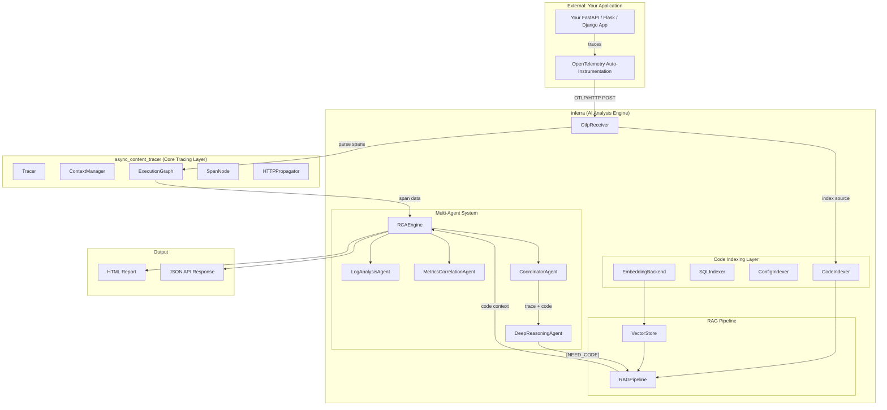
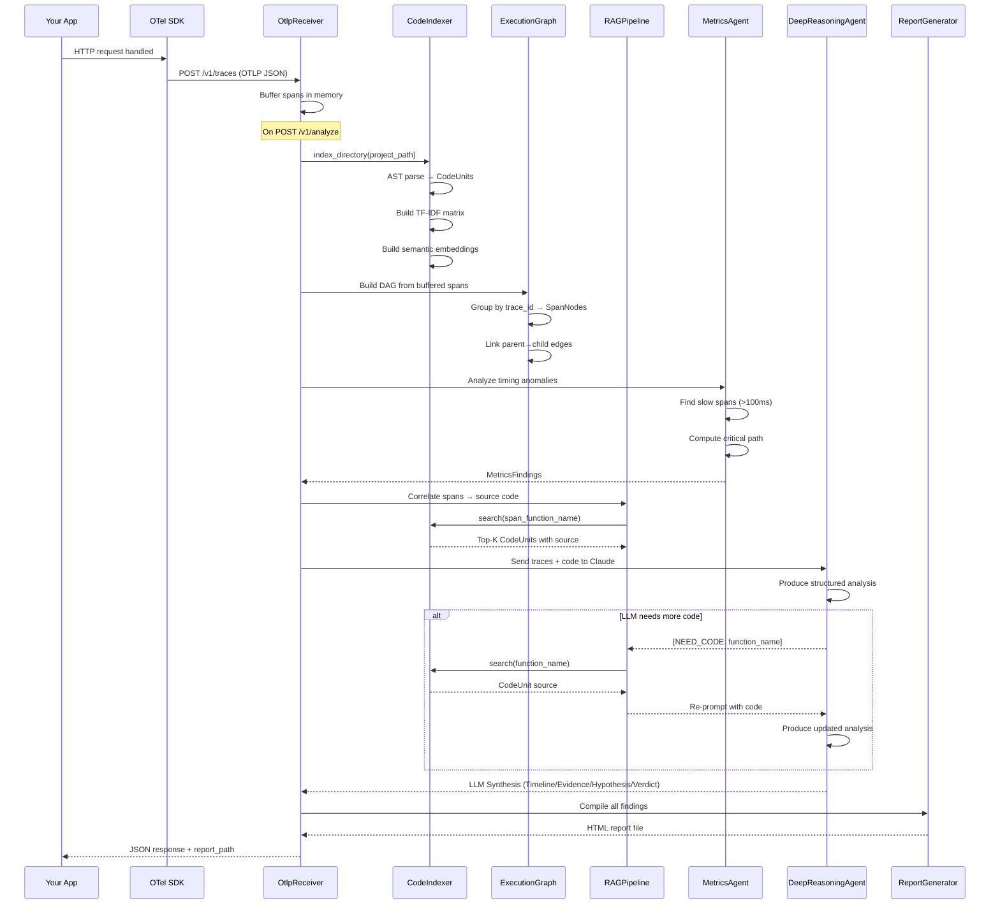

# Inferra — Architecture & Data Flow

## High-Level Architecture



---

## Data Flow Diagram



---

## Component Deep Dive

### Package 1: `async_content_tracer/` — Core Tracing Layer

This package captures what happened during code execution and builds a structural representation of it.

---

#### `tracer.py` — Event Capture Engine

**What it does:** Captures function entry/exit events with timing, thread info, and async context. Provides the `@tracer.trace` decorator and context-aware tracing.

**Why it exists:** Without this, there's no raw data. This is the instrumentation layer that records every function call as a `TraceEvent` with span IDs, parent IDs, timestamps, and thread info.

**Key classes:**
- `TraceEvent` — Single event (function entry or exit) with span_id, parent_span_id, timestamp, context_id
- `Tracer` — Manages event collection, generates span/context IDs, handles `@trace` decorator

---

#### `context.py` — Async Context Propagation

**What it does:** Manages `contextvars.ContextVar` to propagate trace context across `asyncio.create_task()`, thread pool executors, and fire-and-forget tasks.

**Why it exists:** Python's asyncio loses parent context when spawning tasks. This module patches `asyncio.create_task()` and wraps `ThreadPoolExecutor.submit()` so child tasks inherit their parent's trace context. Without this, the execution graph would have orphaned nodes.

**Key classes:**
- `ContextManager` — Stores/restores span context across async boundaries
- Monkey-patches for `asyncio.create_task`, `loop.create_task`

---

#### `graph.py` — Execution Graph Builder (DAG)

**What it does:** Takes raw `TraceEvent` lists and builds a `NetworkX DiGraph` where each node is a function execution (span) and edges represent caller→callee relationships.

**Why it exists:** Raw events are flat lists. The graph reconstructs the causal structure — which function called which, how work branched across threads/tasks, and where context was lost. This is the structural backbone that the AI agents reason about.

**Key classes:**
- `SpanNode` — Node in the DAG with `function_name`, `duration_ms`, `error`, `source_file`, `source_line`
- `ExecutionGraph` — Builds DAG, finds roots/leaves, extracts causal chains, detects context gaps, exports to JSON/DOT/tree

---

#### `http_propagator.py` — Cross-Service Context

**What it does:** Injects/extracts trace context into HTTP headers (`X-Trace-Context`) for distributed tracing across services.

**Why it exists:** In microservice architectures, a single request crosses multiple services. This propagator ensures the trace continues across HTTP boundaries so the execution graph spans the full request lifecycle.

---

### Package 2: `inferra/` — AI Analysis Engine

This package takes the traces and source code, and produces automated root cause analysis.

---

#### `otlp_receiver.py` — OTLP/HTTP Receiver & Pipeline Orchestrator

**What it does:** HTTP server that accepts standard OpenTelemetry OTLP/HTTP traces (`POST /v1/traces`), buffers spans, and orchestrates the full analysis pipeline when `POST /v1/analyze` is called.

**Why it exists:** This is the bridge between any OTel-instrumented app and Inferra. By speaking the standard OTLP protocol, any app that uses Datadog/Jaeger/Zipkin can point to Inferra instead — zero code changes. It also coordinates code indexing, span-to-code correlation, agent dispatch, and report generation.

**Key endpoints:**
| Route | Method | Purpose |
|-------|--------|---------|
| `/v1/traces` | POST | Accept OTLP spans |
| `/v1/analyze` | POST | Trigger RCA on buffered spans |
| `/v1/traces` | GET | View buffered spans |
| `/healthz` | GET | Health check |

**Key methods:**
- `_parse_otlp_spans()` — Decodes OTLP JSON into internal `SpanNode` format
- `_build_rag_context()` — Correlates trace spans to source code via `CodeIndexer.search()`
- `_run_analysis()` — Orchestrates the full pipeline: index → correlate → agents → LLM → report

---

#### `indexer.py` — AST-Based Code Indexer

**What it does:** Parses Python source files using the `ast` module, extracts every function and class as a `CodeUnit`, builds a TF-IDF search matrix and optional semantic embedding index.

**Why it exists:** To map trace span names (like `"GET /api/v1/predict"`) back to the exact source code. Without this, the LLM would only see span names and timing — not the actual code that ran. This is the core RAG data source.

**Key classes:**
- `CodeUnit` — Represents a single function/class with name, source code, file path, line range, docstring
- `CodeIndexer` — Parses directories, builds TF-IDF matrix with `sklearn.TfidfVectorizer`, provides `search()` method

**Search algorithm:**
1. TF-IDF cosine similarity (fast keyword matching)
2. Semantic embedding similarity (meaning-aware via sentence-transformers)
3. Reciprocal Rank Fusion to merge both rankings

---

#### `embeddings.py` — Semantic Embedding Engine

**What it does:** Generates vector embeddings for code snippets using `sentence-transformers` (local) or falls back to TF-IDF. Provides a `VectorStore` for nearest-neighbor search.

**Why it exists:** TF-IDF only matches exact keywords. Semantic embeddings understand that `"database query"` is related to `"db.session.query()"`. This enables the RAG pipeline to find relevant code even when span names don't exactly match function names.

**Key classes:**
- `EmbeddingBackend` — Abstract interface for embedding providers
- `LocalEmbedding` — Uses `sentence-transformers/all-MiniLM-L6-v2` (384-dim)
- `VectorStore` — In-memory nearest-neighbor search over embeddings

---

#### `rag.py` — Context-Aware RAG Pipeline

**What it does:** Given a trace event/error/query, retrieves the most relevant source code from the `CodeIndexer` and packages it into a structured context window for the LLM.

**Why it exists:** The LLM can't read the entire codebase. The RAG pipeline selects only the code that's relevant to the current trace — the functions that were called, the error handlers, the upstream causal chain. This keeps the LLM prompt focused and within token limits.

**Key classes:**
- `RetrievedContext` — Contains: query, matching CodeUnits, related events, causal chain, formatted context string
- `RAGPipeline` — Orchestrates retrieval for events, errors, logs, and free-form queries

**Retrieval modes:**
| Mode | Input | Search Strategy |
|------|-------|-----------------|
| `retrieve_for_event` | TraceEvent | Function name → search + causal chain |
| `retrieve_for_error` | SpanNode with error | Error message → search + full chain to root |
| `retrieve_for_log` | Log line string | Log pattern → grep-style search |
| `retrieve_for_query` | Natural language | Free-form semantic search |

---

#### `agents.py` — Multi-Agent Investigation System

**What it does:** Three specialized agents that each analyze the execution graph from a different angle, then a coordinator synthesizes their findings.

**Why it exists:** Different types of issues require different analysis strategies. Log parsing is different from statistical anomaly detection is different from code-level reasoning. The multi-agent design lets each specialist focus on what it's good at.

**Agents:**

| Agent | Role | Output |
|-------|------|--------|
| `LogAnalysisAgent` | Parses trace events for error patterns, exception chains, warning signals | Error analysis, exception correlation |
| `MetricsCorrelationAgent` | Computes P50/P95/P99 latencies, finds slow spans, identifies critical paths | Performance anomalies, SLO violations |
| `CoordinatorAgent` | Synthesizes findings from all agents, runs RAG queries, produces final RCA | Unified `RCAReport` |

**Key output:**
- `RCAReport` — Structured report with `root_cause`, `severity`, `confidence`, `findings[]`, `recommendations[]`

---

#### `llm_agent.py` — Agentic LLM Reasoning (Claude)

**What it does:** Sends trace data + correlated source code to Claude API, receives structured root cause analysis. Supports an **agentic loop** where Claude can request more code using `[NEED_CODE: function_name]` markers.

**Why it exists:** Statistical agents can find slow spans, but only an LLM can read the actual source code and explain *why* it's slow (e.g., "synchronous DB query blocking the async event loop"). The agentic loop means the LLM isn't limited to the initial code — it can explore the codebase.

**Agentic loop flow:**
```
1. Build prompt: trace summary + correlated code
2. Send to Claude API
3. Parse response for [NEED_CODE: xyz] markers
4. If found → search CodeIndexer for xyz → append to prompt → back to step 2
5. If not found → return final analysis
6. Max 2 iterations to bound latency
```

**Structured output format:**
- `TIMELINE` — What happened chronologically
- `CODE EVIDENCE` — Specific file:line references
- `HYPOTHESIS` — Primary + alternative explanations
- `VERDICT` — `[CONFIDENCE: HIGH/MEDIUM/LOW]` + one-line root cause

---

#### `rca_engine.py` — Pipeline Orchestrator

**What it does:** Top-level entry point that ties `async_content_tracer` (telemetry) to `inferra` (AI reasoning). Accepts trace events, builds graph, runs code indexing, dispatches agents, returns `RCAReport`.

**Why it exists:** Convenience orchestrator so users can do the entire pipeline in 3 lines:
```python
engine = RCAEngine()
engine.index_codebase("/path/to/project")
report = engine.investigate(tracer.events)
```

---

#### `sql_indexer.py` — SQL Schema Indexer

**What it does:** Parses SQL migration files, Alembic scripts, and raw `.sql` files to extract table definitions, foreign keys, and indexes.

**Why it exists:** Many performance issues are in the database layer. Knowing the schema lets the LLM reason about N+1 queries, missing indexes, and join performance.

---

#### `config_indexer.py` — Configuration Indexer

**What it does:** Parses `.env`, `.yaml`, `.toml`, `docker-compose.yml`, and Kubernetes manifests to extract configuration values.

**Why it exists:** Configuration errors (wrong DB host, missing env vars, incorrect timeouts) are a common root cause. Indexing config lets the LLM check for misconfiguration.

---

#### `report_html.py` — HTML Report Generator

**What it does:** Takes analysis results (stats, trace data, agent findings, LLM synthesis) and renders a styled HTML report with CSS, execution graphs, and the AI Deep Reasoning section.

**Why it exists:** The JSON API response is machine-readable but not human-friendly. The HTML report is what engineers actually look at — with visual hierarchy, color-coded severity, and formatted code blocks.

---

## End-to-End Request Lifecycle


| Step | Component | What Happens |
|------|-----------|-------------|
| 1 | Your App | Handles an HTTP request (e.g., `POST /api/v1/predict`) |
| 2 | OTel SDK | Auto-instruments FastAPI, captures entry/exit spans with timing |
| 3 | `OtlpReceiver` | Receives OTLP/HTTP POST, buffers spans in memory |
| 4 | `OtlpReceiver` | `POST /v1/analyze` triggers the pipeline |
| 5 | `CodeIndexer` | Parses project source with `ast.parse()`, builds TF-IDF + embeddings |
| 6 | `ExecutionGraph` | Reconstructs DAG from spans — roots, leaves, causal chains |
| 7 | `RAGPipeline` | Maps span names to source code via hybrid search |
| 8 | `MetricsCorrelationAgent` | Finds slow spans, computes P95, identifies critical path |
| 9 | `DeepReasoningAgent` | Sends traces + code to Claude for structured analysis |
| 10 | Agentic Loop | Claude requests more code with `[NEED_CODE]`, gets it, re-reasons |
| 11 | `report_html.py` | Renders everything into a beautiful HTML report |

---

## File Map

| File | Lines | Purpose |
|------|-------|---------|
| `async_content_tracer/tracer.py` | 540 | Event capture, `@trace` decorator |
| `async_content_tracer/context.py` | 241 | Async context propagation |
| `async_content_tracer/graph.py` | 444 | Execution graph (DAG) builder |
| `async_content_tracer/http_propagator.py` | 170 | Cross-service trace context |
| `inferra/otlp_receiver.py` | ~800 | OTLP server + pipeline orchestrator |
| `inferra/indexer.py` | ~800 | AST code indexer + TF-IDF search |
| `inferra/embeddings.py` | 330 | Semantic embeddings + vector store |
| `inferra/rag.py` | 366 | RAG pipeline (trace→code retrieval) |
| `inferra/agents.py` | ~750 | Multi-agent system (3 agents) |
| `inferra/llm_agent.py` | 486 | Claude integration + agentic loop |
| `inferra/rca_engine.py` | 162 | Top-level orchestrator |
| `inferra/sql_indexer.py` | 320 | SQL schema parser |
| `inferra/config_indexer.py` | 500 | Config file parser |
| `report_html.py` | 276 | HTML report generator |
